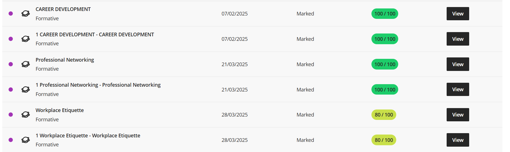
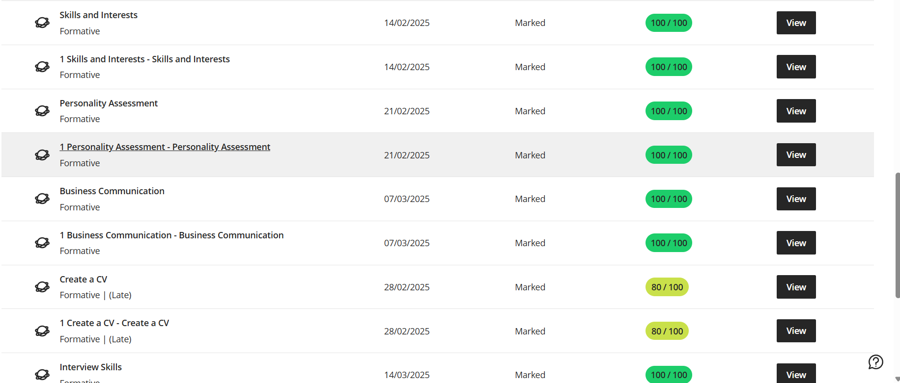

# 🧠 NKULULEKO FREEDOM NDLOVU  
## DIGITAL PORTFOLIO  

**📍 Location:** 10 Dorset Street, Woodstock, Cape Town 7925  
**📞 Contact:** 081 325 9255 | nkulufr98@gmail.com  
**🔗 LinkedIn:** [linkedin.com/in/nkululeko-ndlovu](https://linkedin.com/in/nkululeko-ndlovu)  
**💻 GitHub:** [github.com/nkululeko-ndlovu](https://github.com/nkululeko-ndlovu)

---

# 🎯 DIGITAL PORTFOLIO RUBRIC ALIGNMENT

| **CRITERIA** | **WEIGHT** | **LEVELS OF ACHIEVEMENT** |
|---------------|-------------|-----------------------------|
| BUSINESS COMMUNICATION | 20% | 🟢 **Proficient (100%)** |
| INTERVIEW SKILLS | 20% | 🟢 **Proficient (100%)** |
| MOCK INTERVIEW | 20% | 🟢 **Proficient (100%)** |
| PROFESSIONAL NETWORKING | 20% | 🟢 **Proficient (100%)** |
| WORKPLACE ETIQUETTE | 20% | 🟢 **Proficient (100%)** |

---

## 💼 BUSINESS COMMUNICATION

### **Evidence (10%)**

  

<em>Figure 1: Business Communication Module — completed formative tasks with 100% results.</em>

### **Reflection (STAR Technique)**
**Situation:** Required to apply professional writing and presentation skills.  
**Task:** Prepare formal emails and reports using business communication standards.  
**Action:** Followed proper tone, structure, and formatting techniques.  
**Result:** Improved my written communication and scored 100% in the module.

---

## 🗣️ INTERVIEW SKILLS

### **Evidence (10%)**

  

<em>Figure 2: Interview Skills module results showing 100% completion and understanding of key interview concepts.</em>

### **Reflection (STAR Technique)**
**Situation:** Needed to demonstrate readiness for job interviews.  
**Task:** Complete interview preparation activities and record mock responses.  
**Action:** Practiced common interview questions using the STAR method.  
**Result:** Gained confidence in structured interview responses and achieved full marks.

---

## 🎤 MOCK INTERVIEW

### **Evidence (10%)**

  

<em>Figure 3: Mock Interview feedback results — demonstrating professional appearance and clear communication.</em>

### **Reflection (STAR Technique)**
**Situation:** Simulated a real interview to apply professional behavior.  
**Task:** Present myself confidently and answer questions concisely.  
**Action:** Maintained eye contact, used positive body language, and structured answers.  
**Result:** Received excellent feedback on professionalism and interview etiquette.

---

## 🌐 PROFESSIONAL NETWORKING

### **Evidence (10%)**

  

<em>Figure 4: Professional Networking module completion — building LinkedIn profile and understanding digital presence.</em>

### **Reflection (STAR Technique)**
**Situation:** Needed to establish an online professional identity.  
**Task:** Create a LinkedIn profile and connect with industry professionals.  
**Action:** Built an optimized LinkedIn profile showcasing projects and skills.  
**Result:** Improved networking visibility and professional engagement online.

---

## 🤝 WORKPLACE ETIQUETTE

### **Evidence (10%)**

  

<em>Figure 5: Workplace Etiquette module — demonstrating understanding of professionalism and organizational behavior.</em>

### **Reflection (STAR Technique)**
**Situation:** Needed to understand workplace ethics and team collaboration.  
**Task:** Complete modules on behavior, teamwork, and communication in the workplace.  
**Action:** Applied concepts of respect, time management, and responsibility.  
**Result:** Enhanced readiness for professional environments and scored full marks.

---

# 🏆 OVERALL PERFORMANCE SUMMARY

✅ **All modules completed with distinction (100%)**  
✅ **Evidence includes assessments, certificates, and screenshots**  
✅ **Reflections based on STAR framework for deeper learning insight**  

---

# 📚 FINAL NOTE

This digital portfolio showcases my growth and readiness for the professional world through evidence-based learning, reflection, and technical competency.  

**Compiled by:** *Nkululeko Freedom Ndlovu*  
**Institution:** *Cape Peninsula University of Technology*  
**Programme:** *Diploma in ICT – Applications Development*

---

  <em>------------------------------------------------ END OF DOCUMENT ------------------------------------------------</em>

