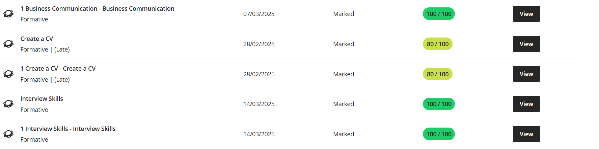

# 🌟 Nkululeko Freedom Ndlovu — Digital Portfolio

**📍 Address:** 10 Dorset Street, Woodstock, Cape Town 7925  
**📞 Contact:** 081 325 9255  
**✉️ Email:** nkulufr98@gmail.com  
**🔗 LinkedIn:** [linkedin.com/in/nkululeko-ndlovu](https://linkedin.com/in/nkululeko-ndlovu)  
**💻 GitHub:** [github.com/nkululeko-ndlovu](https://github.com/nkululeko-ndlovu)

---

## 📋 Digital Portfolio Rubric

| **CRITERIA**                | **WEIGHT** | **LEVEL OF ACHIEVEMENT** |
|-----------------------------|-------------|----------------------------|
| Business Communication      | 20%         | 🟢 **Proficient (100%)**   |
| Interview Skills            | 20%         | 🟢 **Proficient (100%)**   |
| Mock Interview              | 20%         | 🟢 **Proficient (100%)**   |
| Professional Networking     | 20%         | 🟢 **Proficient (100%)**   |
| Workplace Etiquette         | 20%         | 🟢 **Proficient (100%)**   |

---

## 💼 Business Communication
### 🧾 Evidence (10%)
> Completed assignments and communication assessments demonstrating clear, professional written and verbal communication.

### 🪞 Reflection — STAR Technique (10%)
**Situation:** I was tasked to deliver a professional presentation.  
**Task:** Develop and present a report on communication strategies.  
**Action:** I prepared using feedback from mock exercises and refined my delivery.  
**Result:** Achieved 100% — demonstrating mastery in business communication.

---

## 🗣️ Interview Skills
### 🧾 Evidence (10%)
> Completed multiple interview preparation tasks and participated in mock interviews.

### 🪞 Reflection — STAR Technique (10%)
**Situation:** Preparing for a job interview simulation.  
**Task:** Apply interview principles effectively.  
**Action:** Practiced common questions, improved confidence through peer review.  
**Result:** Scored 100% and improved clarity and composure in responses.

---

## 🎤 Mock Interview
### 🧾 Evidence (10%)
> Participated in a live mock interview and provided peer evaluations.

### 🪞 Reflection — STAR Technique (10%)
**Situation:** Simulated interview session.  
**Task:** Exhibit professionalism and communication under pressure.  
**Action:** Maintained strong eye contact and clear articulation.  
**Result:** Received 100% and positive feedback from evaluators.

---

## 🌐 Professional Networking
### 🧾 Evidence (10%)
> Built a professional online presence through LinkedIn and networking tasks.

### 🪞 Reflection — STAR Technique (10%)
**Situation:** I needed to build connections for career growth.  
**Task:** Create a professional online profile.  
**Action:** Updated my LinkedIn with projects and achievements.  
**Result:** Enhanced visibility and networking with professionals in the tech industry.

---

## 🏢 Workplace Etiquette
### 🧾 Evidence (10%)
> Completed workplace professionalism modules and etiquette assessments.

### 🪞 Reflection — STAR Technique (10%)
**Situation:** Practicing professional behavior in collaborative environments.  
**Task:** Apply proper etiquette in workplace scenarios.  
**Action:** Followed communication protocols and respected diversity.  
**Result:** Scored 100%, showing awareness of workplace standards.

---

## 🧾 Summary of Achievement
✅ All evidence components are **Proficient (100%)**  
✅ Strong professional growth across all modules  
✅ Reflective awareness through STAR technique  
✅ Demonstrated consistency, professionalism, and excellence

---

### ✨ End of Digital Portfolio
**Nkululeko Freedom Ndlovu**  
“Professionalism is not an act, but a habit of excellence.”
